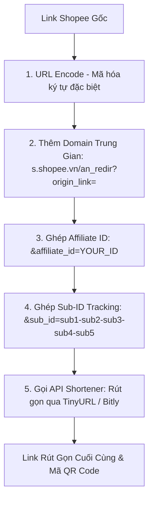

# ⚡ Shopee Affiliate All-In-One Optimization Suite

Hệ thống tối ưu hóa và tự động hóa Tiếp thị Liên kết Shopee toàn diện. Tích hợp 4 nền tảng: **Web Dashboard**, **Chrome Extension**, **Google Sheets Script** và **Telegram Bot**.

---

## 📐 Quy Trình Hoạt Động Kỹ Thuật (System Workflow)

Mọi link Affiliate được tạo qua hệ thống đều tuân thủ chính xác quy chuẩn của Shopee (theo Bài viết 172955):



### 1. URL Encoding (Mã hóa URL)
Link Shopee gốc (ví dụ `https://shopee.vn/product/123/456`) sẽ được mã hóa toàn bộ ký tự đặc biệt như `:`, `/`, `?`, `=` thành dạng URL-Safe (`https%3A%2F%2Fshopee.vn%2Fproduct%2F123%2F456`).

### 2. Ghép Tham Số Affiliate & Tracking Sub-ID
Link sau mã hóa được ghép vào định dạng chuẩn của Shopee:
`https://s.shopee.vn/an_redir?origin_link={ENCODED_URL}&affiliate_id={AFFILIATE_ID}&sub_id={SUB_ID}`

- **Affiliate ID:** Mã ID định danh nhà bán/publisher.
- **Sub-ID:** 5 giá trị phân cách bằng dấu `-` giúp phân loại chính xác doanh số đến từ bài đăng nào, kênh nào (Facebook, TikTok, Zalo, Telegram...).

### 3. Rút Gọn & Tạo Mã QR
Link Affiliate chuẩn sau đó được rút gọn tự động thông qua API rút gọn link và tạo mã QR Code tương ứng giúp dễ dàng chèn vào hình ảnh hoặc bài viết.

---

## 🛠️ Bộ 4 Công Cụ Tích Hợp

| STT | Công Cụ | Mô Tả & Sử Dụng | Vị Trí Code |
|---|---|---|---|
| 1 | **Web Dashboard** | Giao diện quản lý tạo link đơn & chuyển đổi hàng loạt, xuất file Excel. | `index.html`, `js/app.js`, `css/style.css` |
| 2 | **Chrome Extension** | Tiện ích mở rộng tạo link 1-click ngay khi lướt web Shopee. | `chrome-extension/` |
| 3 | **Google Sheets Script** | Tự động hóa tạo link trực tiếp bằng công thức trong Bảng tính. | `google-sheets/ShopeeAffiliate.gs` |
| 4 | **Telegram Bot** | Bot tự động phản hồi link Affiliate ngắn khi quăng link vào khung chat. | `telegram-bot/bot.py` |

---

## 🚀 Hướng Dẫn Khởi Chạy

### 1. Mở Web Dashboard:
Truy cập trực tiếp file `index.html` trên bất kỳ trình duyệt nào.

### 2. Cài Chrome Extension:
1. Mở `chrome://extensions/`
2. Bật **Developer Mode**.
3. Chọn **Load unpacked** -> Trỏ tới thư mục `chrome-extension/`.

### 3. Cài Google Sheets Script:
 Mở Google Sheets -> *Extensions > Apps Script* -> Dán mã từ `google-sheets/ShopeeAffiliate.gs`.

### 4. Chạy Telegram Bot:
```bash
cd telegram-bot
pip install -r requirements.txt
python bot.py
```
